# ViBeta Chat - Database Schema Diagram

## 📊 Sơ đồ Database

```mermaid
erDiagram
    USERS {
        string id PK "Primary Key"
        string username UK "Unique, Not Null"
        string email UK "Unique, Not Null" 
        string full_name "Not Null"
        string avatar "Nullable"
        enum status "online|offline|away|busy"
        datetime last_active
        datetime created_at
        datetime updated_at
        datetime deleted_at "Soft Delete"
    }

    CONVERSATIONS {
        string id PK "Primary Key"
        enum type "direct|group, Not Null"
        string name "Nullable"
        string description "Nullable"
        string avatar "Nullable"
        string created_by FK "Foreign Key -> users.id"
        datetime created_at
        datetime updated_at
        datetime deleted_at "Soft Delete"
    }

    MESSAGES {
        string id PK "Primary Key"
        string conversation_id FK "Foreign Key -> conversations.id"
        string sender_id FK "Foreign Key -> users.id"
        text content "Message content"
        enum type "text|image|file|system|reaction"
        enum status "sent|delivered|read|failed"
        string reply_to_id FK "Foreign Key -> messages.id"
        text attachments "JSON string"
        text reactions "JSON string"
        datetime edited_at "Nullable"
        datetime created_at
        datetime updated_at
        datetime deleted_at "Soft Delete"
    }

    CONVERSATION_PARTICIPANTS {
        integer id PK "Auto Increment"
        string conversation_id FK "Foreign Key -> conversations.id"
        string user_id FK "Foreign Key -> users.id"
        datetime joined_at "Default: CURRENT_TIMESTAMP"
        datetime left_at "Nullable"
    }

    %% Relationships
    USERS ||--o{ CONVERSATIONS : creates
    USERS ||--o{ MESSAGES : sends
    USERS ||--o{ CONVERSATION_PARTICIPANTS : participates
    
    CONVERSATIONS ||--o{ MESSAGES : contains
    CONVERSATIONS ||--o{ CONVERSATION_PARTICIPANTS : has
    
    MESSAGES ||--o{ MESSAGES : replies_to
```



## 🔗 Chi tiết mối quan hệ (Relationships)

### 1. **Users → Conversations** (1:N)
- Một user có thể tạo nhiều conversations
- Mỗi conversation có một creator (created_by)

### 2. **Users → Messages** (1:N)
- Một user có thể gửi nhiều messages
- Mỗi message có một sender (sender_id)

### 3. **Users ↔ Conversations** (M:N thông qua Conversation_Participants)
- Một user có thể tham gia nhiều conversations
- Một conversation có thể có nhiều participants
- Bảng trung gian: `conversation_participants`

### 4. **Conversations → Messages** (1:N)
- Một conversation có thể chứa nhiều messages
- Mỗi message thuộc về một conversation

### 5. **Messages → Messages** (Self-Reference)
- Tin nhắn có thể reply tin nhắn khác
- `reply_to_id` tham chiếu đến `messages.id`

## 📋 Bảng chi tiết

### 🧑‍💻 **USERS** Table
| Field | Type | Constraints | Description |
|-------|------|-------------|-------------|
| `id` | VARCHAR(255) | PRIMARY KEY | User unique identifier |
| `username` | VARCHAR(255) | UNIQUE, NOT NULL | Username for login |
| `email` | VARCHAR(255) | UNIQUE, NOT NULL | Email address |
| `full_name` | VARCHAR(255) | NOT NULL | Display name |
| `avatar` | VARCHAR(500) | NULLABLE | Profile picture URL |
| `status` | ENUM | DEFAULT 'offline' | online, offline, away, busy |
| `last_active` | TIMESTAMP | | Last activity time |
| `created_at` | TIMESTAMP | | Account creation time |
| `updated_at` | TIMESTAMP | | Last update time |
| `deleted_at` | TIMESTAMP | NULLABLE | Soft delete timestamp |

### 💬 **CONVERSATIONS** Table
| Field | Type | Constraints | Description |
|-------|------|-------------|-------------|
| `id` | VARCHAR(255) | PRIMARY KEY | Conversation unique identifier |
| `type` | ENUM | NOT NULL | direct (1-1) or group |
| `name` | VARCHAR(255) | NULLABLE | Group name (null for direct) |
| `description` | TEXT | NULLABLE | Group description |
| `avatar` | VARCHAR(500) | NULLABLE | Group avatar URL |
| `created_by` | VARCHAR(255) | FK → users.id | Creator user ID |
| `created_at` | TIMESTAMP | | Creation time |
| `updated_at` | TIMESTAMP | | Last update time |
| `deleted_at` | TIMESTAMP | NULLABLE | Soft delete timestamp |

### 📨 **MESSAGES** Table
| Field | Type | Constraints | Description |
|-------|------|-------------|-------------|
| `id` | VARCHAR(255) | PRIMARY KEY | Message unique identifier |
| `conversation_id` | VARCHAR(255) | FK → conversations.id | Parent conversation |
| `sender_id` | VARCHAR(255) | FK → users.id | Message sender |
| `content` | TEXT | | Message text content |
| `type` | ENUM | NOT NULL | text, image, file, system, reaction |
| `status` | ENUM | DEFAULT 'sent' | sent, delivered, read, failed |
| `reply_to_id` | VARCHAR(255) | FK → messages.id | Replied message ID |
| `attachments` | TEXT | NULLABLE | JSON array of file attachments |
| `reactions` | TEXT | NULLABLE | JSON array of emoji reactions |
| `edited_at` | TIMESTAMP | NULLABLE | Last edit time |
| `created_at` | TIMESTAMP | | Message creation time |
| `updated_at` | TIMESTAMP | | Last update time |
| `deleted_at` | TIMESTAMP | NULLABLE | Soft delete timestamp |

### 👥 **CONVERSATION_PARTICIPANTS** Table
| Field | Type | Constraints | Description |
|-------|------|-------------|-------------|
| `id` | INTEGER | PRIMARY KEY, AUTO_INCREMENT | Participant record ID |
| `conversation_id` | VARCHAR(255) | FK → conversations.id | Conversation ID |
| `user_id` | VARCHAR(255) | FK → users.id | Participant user ID |
| `joined_at` | TIMESTAMP | DEFAULT CURRENT_TIMESTAMP | Join time |
| `left_at` | TIMESTAMP | NULLABLE | Leave time (null = active) |

## 🗂️ Indexes

### **USERS**
- `idx_users_username` (UNIQUE)
- `idx_users_email` (UNIQUE)
- `idx_users_deleted_at`

### **CONVERSATIONS**
- `idx_conversations_created_by`
- `idx_conversations_deleted_at`

### **MESSAGES**
- `idx_messages_conversation_id`
- `idx_messages_sender_id`
- `idx_messages_reply_to_id`
- `idx_messages_deleted_at`

### **CONVERSATION_PARTICIPANTS**
- `idx_conversation_participants_conversation_id`
- `idx_conversation_participants_user_id`

## 💾 Database Engine
- **Primary**: PostgreSQL (Production)
- **Fallback**: SQLite (Development)
- **ORM**: GORM (Go ORM Library)

## 🔄 Features Supported

### ✅ **Implemented**
- User management với soft delete
- Conversation creation (direct + group)
- Message sending và persistence
- Conversation participants tracking
- Message replies
- Emoji reactions (JSON field)
- File attachments (JSON field)

### 🔄 **Planned**
- Message read receipts
- User roles trong conversations
- Message search indexing
- File storage optimization
- Message encryption

## 📝 Sample Queries

### Get user's conversations:
```sql
SELECT c.* FROM conversations c
JOIN conversation_participants cp ON cp.conversation_id = c.id
WHERE cp.user_id = ? AND cp.left_at IS NULL;
```

### Get conversation messages:
```sql
SELECT m.*, u.username, u.avatar as sender_avatar 
FROM messages m
JOIN users u ON u.id = m.sender_id
WHERE m.conversation_id = ?
ORDER BY m.created_at ASC
LIMIT 50;
```

### Get active participants:
```sql
SELECT u.* FROM users u
JOIN conversation_participants cp ON cp.user_id = u.id
WHERE cp.conversation_id = ? AND cp.left_at IS NULL;
```

---
*Sơ đồ này được tạo tự động từ GORM models trong dự án ViBeta Chat*
